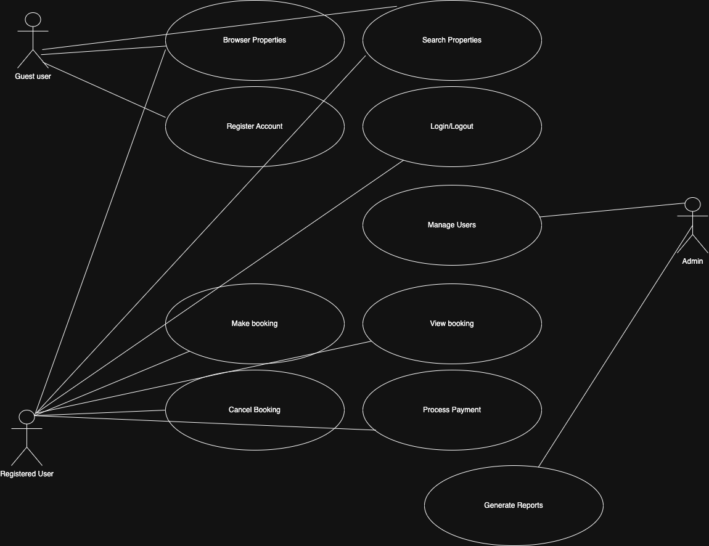

# Requirement Analysis in Software Development

This repository is part of the ALX project, designed to simulate a real-world software development process. It focuses on documenting, analyzing, and structuring software requirements for a **Booking Management System**. The purpose is to understand how a solid requirement foundation contributes to successful project execution.

# What is Requirement Analysis?

Requirement Analysis is the process of determining user expectations for a new or modified product. These requirements must be quantifiable, relevant, and detailed. In the Software Development Life Cycle (SDLC), requirement analysis plays a vital role in ensuring all stakeholders have a clear understanding of the software’s goals.

This process involves collecting, analyzing, validating, and documenting the needs of stakeholders, which sets the foundation for the design, development, and testing phases. A well-done requirement analysis helps reduce costly mistakes during development and ensures the final product meets user expectations.

# Why is Requirement Analysis Important?

1. **Minimizes Errors and Rework**: By clearly understanding user needs upfront, the development team avoids costly errors and extensive rework later.
2. **Improves Communication**: It bridges the gap between technical teams and non-technical stakeholders, ensuring everyone is aligned.
3. **Guides Development**: Clear requirements serve as a blueprint, guiding design, coding, and testing activities throughout the project.

# Key Activities in Requirement Analysis

- **Requirement Gathering**: Collecting requirements from stakeholders via interviews, questionnaires, observations, and documentation reviews.
- **Requirement Elicitation**: Refining and exploring the gathered information to identify the actual needs.
- **Requirement Documentation**: Structuring the requirements in a well-defined format, such as SRS (Software Requirements Specification).
- **Requirement Analysis and Modeling**: Analyzing dependencies, constraints, and conflicts; modeling requirements through diagrams and flowcharts.
- **Requirement Validation**: Ensuring the documented requirements are complete, correct, and feasible.

# Types of Requirements

## Functional Requirements

Functional requirements define the specific behavior or functions of the system. Examples for a Booking Management System:
- Users can create an account and log in.
- Users can search for available booking slots.
- Admins can approve or reject bookings.

## Non-functional Requirements

Non-functional requirements describe how the system performs a function. Examples:
- The system should respond to user queries within 2 seconds.
- The platform should be available 99.9% of the time.
- The system should support at least 10,000 concurrent users.

# Use Case Diagrams

Use Case Diagrams visually represent system actors and interactions. They help stakeholders quickly understand system functionality at a high level.

# Acceptance Criteria

Acceptance Criteria are predefined conditions that a software product must satisfy to be accepted by a user or stakeholder. They help in validating that the system meets business needs and user expectations.

**Example - Checkout Feature Acceptance Criteria:**
- The system should allow users to view booking summary before checkout.
- Payment gateway must support credit card and mobile payment methods.
- A confirmation email should be sent upon successful checkout.
- Booking status must update immediately after payment confirmation.

